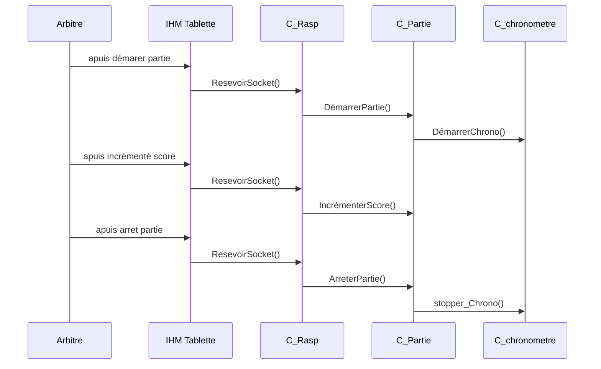
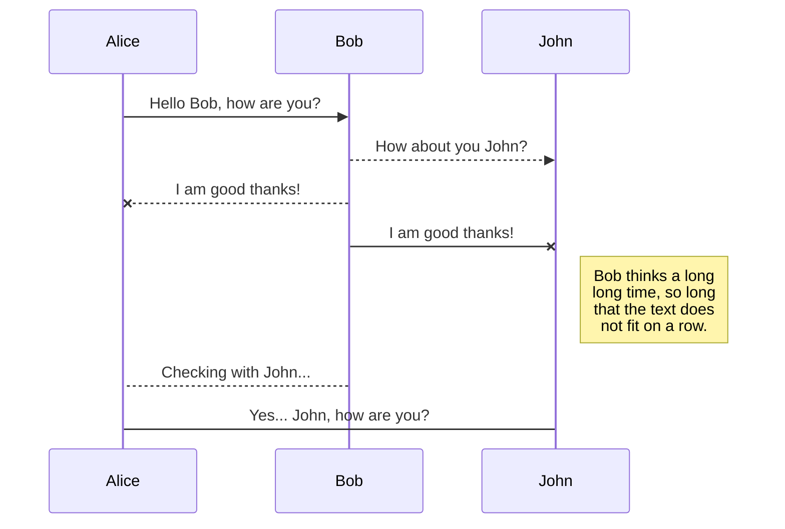
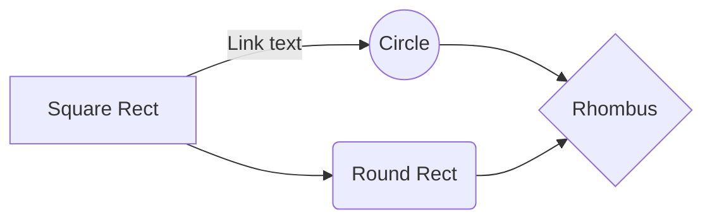

# SportJet

Une création "**original**" - Lycée de Lorgues
**SportJet** est un Mini projet de BTS Snir.

## Utilisation
**SportJet** est un ensemble matériel.
un Arduino est connecter au réseau via une connexion Ethernet et peut etre controler via un Appareil Android.

# Mise en place - Lancement ( En Dev)
## Serveur BDD
le Serveur BDD permet d'enregistré le score des match.
## Raspberry Pi
le Raspberry Pi controle en I2C le panneux LED, il recois via des Socket les commande a exercé sur le Panneux.
## Application Android
Permet d'envoier des ordres via des Socket sur le réseau, il permet donc de controler le panneau LED.

# UML
## Diagram de déploiment

## Scénarii

- L&#39;arbitre assistant démarre une partie. Le chronomètre démarre. Le score s&#39;initialise à 0:0.
- L&#39;arbitre assistant peut stopper le chronomètre et le relancer.
- L&#39;arbitre assistant peut incrémenter ou décrémenter le score d&#39;une des deux équipes.
- Si un problème de connexion réseau à lieu alors l&#39;arbitre assistant utilise le boîter de commande.
- L&#39;arbitre assistant enregistrer le score de la partie, puis le transmettre à la fédération.
- Il signale la fin d&#39;une période.

## Diagramme de sequence partie

 

Version Bouml

 

## Diagramme de sequence chrono

# BDD

# Publication

Publishing in StackEdit makes it simple for you to publish online your files. Once you're happy with a file, you can publish it to different hosting platforms like **Blogger**, **Dropbox**, **Gist**, **GitHub**, **Google Drive**, **WordPress** and **Zendesk**. With [Handlebars templates](http://handlebarsjs.com/), you have full control over what you export.

> Before starting to publish, you must link an account in the **Publish** sub-menu.

## Publish a File

You can publish your file by opening the **Publish** sub-menu and by clicking **Publish to**. For some locations, you can choose between the following formats:

- Markdown: publish the Markdown text on a website that can interpret it (**GitHub** for instance),
- HTML: publish the file converted to HTML via a Handlebars template (on a blog for example).

## Update a publication

After publishing, StackEdit keeps your file linked to that publication which makes it easy for you to re-publish it. Once you have modified your file and you want to update your publication, click on the **Publish now** button in the navigation bar.

> **Note:** The **Publish now** button is disabled if your file has not been published yet.

# Markdown extensions

StackEdit extends the standard Markdown syntax by adding extra **Markdown extensions**, providing you with some nice features.

> **ProTip:** You can disable any **Markdown extension** in the **File properties** dialog.

## SmartyPants

SmartyPants converts ASCII punctuation characters into "smart" typographic punctuation HTML entities. For example:

|                |ASCII                          |HTML                         |
|----------------|-------------------------------|-----------------------------|
|Single backticks|`'Isn't this fun?'`            |'Isn't this fun?'            |
|Quotes          |`"Isn't this fun?"`            |"Isn't this fun?"            |
|Dashes          |`-- is en-dash, --- is em-dash`|-- is en-dash, --- is em-dash|

## KaTeX

You can render LaTeX mathematical expressions using [KaTeX](https://khan.github.io/KaTeX/):

The *Gamma function* satisfying $\Gamma(n) = (n-1)!\quad\forall n\in\mathbb N$ is via the Euler integral

$$
\Gamma(z) = \int_0^\infty t^{z-1}e^{-t}dt\,.
$$

> You can find more information about **LaTeX** mathematical expressions [here](http://meta.math.stackexchange.com/questions/5020/mathjax-basic-tutorial-and-quick-reference).

## UML diagrams

You can render UML diagrams using [Mermaid](https://mermaidjs.github.io/). For example, this will produce a sequence diagram:

And this will produce a flow chart:

